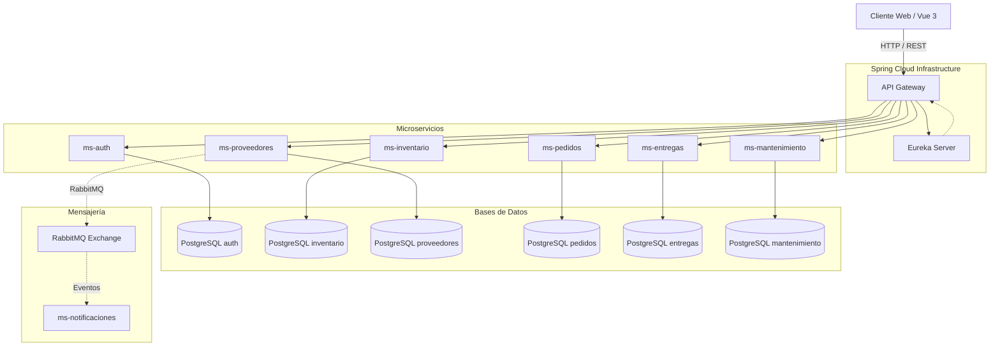

# Arquitectura General

El sistema **Madera & Minería** está construido utilizando una arquitectura basada en **Microservicios**. Este enfoque permite que diferentes módulos del sistema (inventario, mantenimiento, pedidos, etc.) evolucionen, se escalen y se mantengan de manera independiente.

## Diagrama Conceptual

## Componentes Clave

### 1. API Gateway (`api-gateway`)
Es el único punto de entrada público para los clientes (Frontend). Construido con **Spring Cloud Gateway** (basado en WebFlux y Netty), se encarga de:
- **Enrutamiento (Routing):** Redirige las peticiones entrantes (ej. `/api/inventario/**`) al microservicio correspondiente ocultando las IPs y puertos internos.
- **Seguridad (Filtro JWT):** Intercepta las peticiones y valida el token JWT generado por `ms-auth`. Si el token es inválido o no está, rechaza la petición con un error `401 Unauthorized`.
- **CORS:** Maneja las políticas de Cross-Origin para permitir peticiones desde el frontend en Vue.

### 2. Service Discovery (`eureka-server`)
Construido con **Netflix Eureka**, es el directorio telefónico de nuestra arquitectura.
- Cada vez que un microservicio arranca, se "registra" en Eureka diciendo *"Hola, soy ms-inventario y estoy en el puerto 8083"*.
- El API Gateway y los demás microservicios consultan a Eureka para saber a qué IP y puerto deben dirigir sus peticiones internas, permitiendo el balanceo de carga nativo y tolerancia a contenedores que cambian de IP en Docker.

### 3. Frontend (`madera-frontend`)
Aplicación de una sola página (SPA) construida con **Vue 3**, **Vite** y **TailwindCSS**. Se conecta exclusivamente al API Gateway. Usa **Pinia** para la gestión del estado (autenticación, inventarios cargados, etc.) y **Axios** (con interceptores) para adjuntar el JWT en cada petición HTTP.

### 4. Bases de Datos Independientes
Cada microservicio posee su propia base de datos PostgreSQL. Esto respeta el patrón de "Base de datos por servicio", asegurando que si la base de datos de proveedores se cae, el sistema de mantenimiento o entregas puede seguir funcionando.
